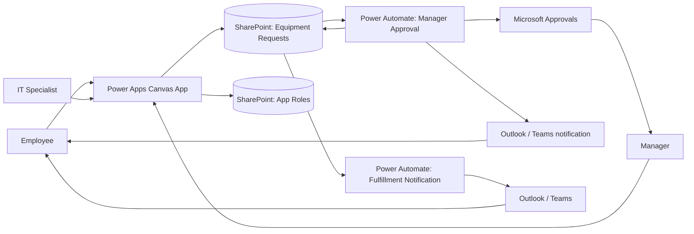

# Architecture

## Trust boundaries

- Power Apps controls the user experience.
- SharePoint stores the business records and version history.
- Power Automate owns the authoritative approval transition.
- App role visibility is not treated as sufficient authorization by itself.
